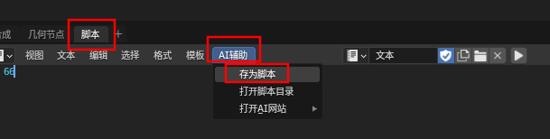
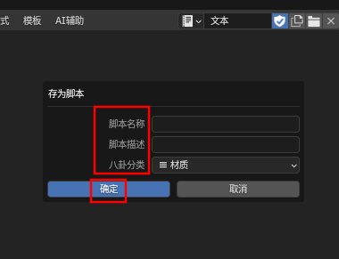
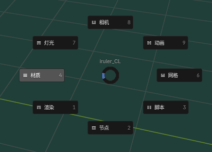
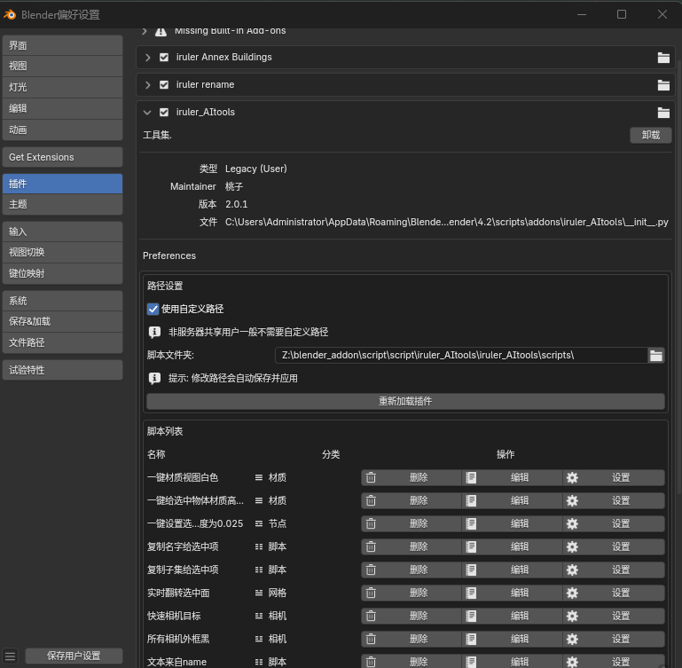

## 介绍
看视频介绍最直接→[bilibili][lxt_bilibili6]

[lxt_bilibili6]: https://space.bilibili.com/256806234
一个便捷工具集，为 Blender 用户管理储存、管理曾经用过的脚本。迎合AI的潮流，提升效率！
## 功能
1. **动态脚本加载**：该插件能够动态加载指定文件夹内的 Python 脚本。用户只需将相关脚本放置在特定文件夹中，插件便会自动识别

2. **脚本保存功能**：当用户在 Blender 的文本编辑器中编写好脚本后，iruler_AItools 插件提供了 “存为脚本” 的功能。用户可以为脚本设置名称和描述，插件会将文本编辑器中的内容保存为新的 Python 脚本文件。
   
   

   如果您希望手动在电脑文件夹中自己copy进去脚本，而不是用保存功能的话，需要注意：您的每个脚本的第一行内容会被用作按钮名称；第二行是功能描述；第三行是分类，如下（#号和空格也需要，可以参考/scripts文件的示例）：
   ```python 
   # 所有相机外框黑
   # 所有相机外框黑
   # 4相机
   import bpy
   ....您的脚本....
   ```

3. **便捷菜单操作**：插件创建了动态菜单和 Pie 菜单，用户可以通过这些菜单方便地访问和执行加载的脚本。其中，Pie 菜单可通过快捷键 F7 调出
   **按F7**：

   
## 安装
插件测试过 Blender 4.2.0 -- 4.4.1版本，其他版本自测
1. 和普遍zip安装方式一样，下载本页面zip，打开 Blender，进入 `编辑` -> `首选项` -> `插件`。
2. **获取插件文件**：提供了一些我自己常用的脚本，在插件安装目录的scripts文件夹中，你可以根据需要解压到本地文件夹，然后设置到插件的scripts文件夹中。如下图，请注意叹号内容：
   

#### 以上
在安装和使用过程中，如果遇到任何问题，或者分享自制有趣脚本思路遇见问题，请私聊[李小桃的bilibili][lxt_bilibili]。

[lxt_bilibili]: https://space.bilibili.com/256806234